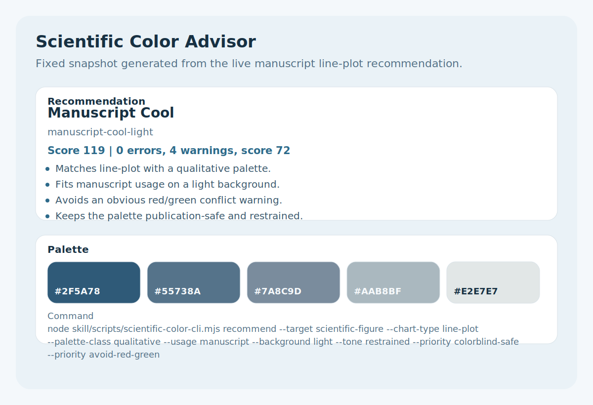
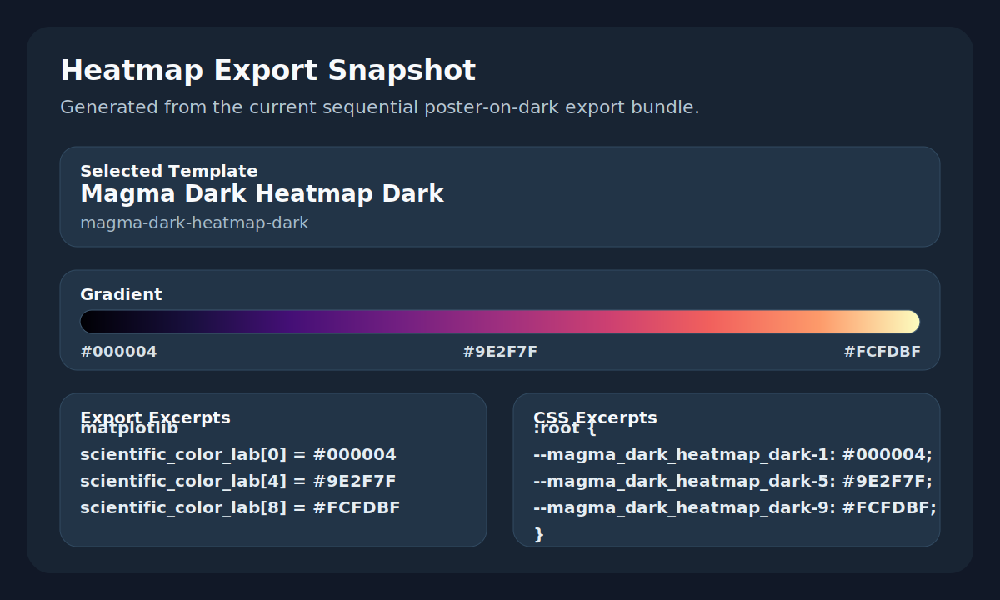
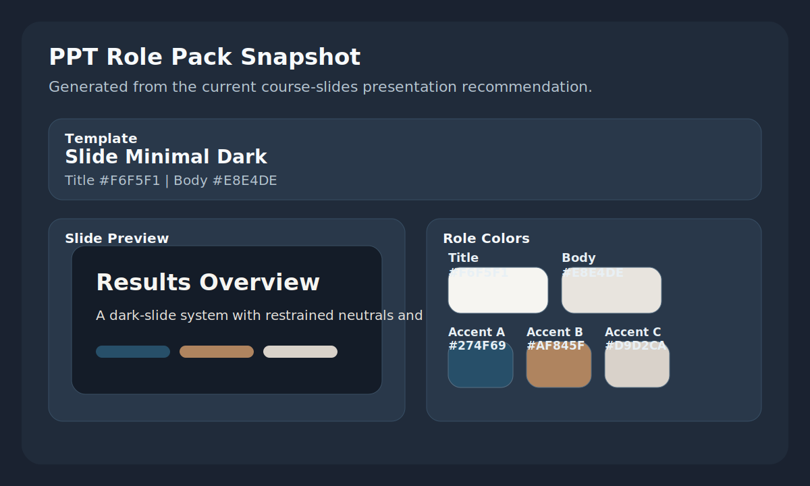

# Scientific Color Advisor

[中文说明](./README_CN.md)

Scientific Color Advisor is an Agent Skills style repository for scientific figure palettes and PPT color systems. It ships with a local Node CLI, a vendored snapshot of [Scientific-Color-Lab](https://github.com/groele/Scientific-Color-Lab), diagnostic scoring, and export-ready outputs for plotting workflows.

## Features

- Recommend palettes for line plots, scatter plots, bar charts, heatmaps, concept figures, and presentation slides
- Support two targets: `scientific-figure` and `ppt`
- Return ranked recommendations, HEX lists, diagnostics, quick-fix hints, and reusable export payloads
- Export palette payloads for `matplotlib`, `plotly`, `matlab`, `css`, `json`, and `summary`
- Generate a PPT role pack with title, body text, accent, and chart colors
- Run in standalone vendored mode or optionally inspect a local `Scientific-Color-Lab` checkout

## Installation

Install the skill from GitHub:

```bash
python ~/.codex/skills/.system/skill-installer/scripts/install-skill-from-github.py --repo OWNER/scientific-color-advisor --path skill
```

Replace `OWNER` with the GitHub account that hosts this repository, then restart the client.

Natural-language install prompt for skill-aware coding agents:

```text
Install the scientific-color-advisor skill from GitHub repo OWNER/scientific-color-advisor path skill.
```

For coding agents that support GitHub repo/path skill installation, use the same repository and `skill` path. For agents that do not support the Agent Skills format directly, clone the repository and use the CLI commands shown below.

## Quick Start

Recommend a manuscript-safe line-plot palette:

```bash
node skill/scripts/scientific-color-cli.mjs recommend --target scientific-figure --chart-type line-plot --palette-class qualitative --usage manuscript --background light --tone restrained --priority colorblind-safe --priority avoid-red-green
```

Recommend a PPT color system in JSON form:

```bash
node skill/scripts/scientific-color-cli.mjs recommend --target ppt --chart-type presentation-slide --palette-class qualitative --usage course-slides --background dark --tone strong --output json
```

Export a heatmap recommendation:

```bash
node skill/scripts/scientific-color-cli.mjs export --target scientific-figure --chart-type heatmap --palette-class sequential --usage poster --background dark --tone strong --format matplotlib --format css
```

Check runtime mode and optional local-repo compatibility:

```bash
node skill/scripts/scientific-color-cli.mjs doctor --repo /path/to/Scientific-Color-Lab
```

## Example Results

These examples show the kind of recommendation payloads the repository actually produces.

### 1. Manuscript-safe line plot

Command:

```bash
node skill/scripts/scientific-color-cli.mjs recommend --target scientific-figure --chart-type line-plot --palette-class qualitative --usage manuscript --background light --tone restrained --priority colorblind-safe --priority avoid-red-green
```

Result snapshot:

- Template: `Manuscript Cool`
- Why it works: manuscript-safe, restrained, avoids obvious red/green conflicts
- Suggested quick fixes: `increase-categorical-spacing`, `suggest-safer-template`

Snapshot:



### 2. Dark heatmap export pack

Command:

```bash
node skill/scripts/scientific-color-cli.mjs export --target scientific-figure --chart-type heatmap --palette-class sequential --usage poster --background dark --tone strong --format matplotlib --format css
```

Selected template:

- `Magma Dark Heatmap Dark`

Excerpt:

```python
scientific_color_lab = [
    {"name": "magma-dark-heatmap-dark 1", "hex": "#000004"},
    {"name": "magma-dark-heatmap-dark 5", "hex": "#9E2F7F"},
    {"name": "magma-dark-heatmap-dark 9", "hex": "#FCFDBF"},
]
```

```css
:root {
  --magma_dark_heatmap_dark-1: #000004;
  --magma_dark_heatmap_dark-5: #9E2F7F;
  --magma_dark_heatmap_dark-9: #FCFDBF;
}
```

Snapshot:



### 3. PPT slide-role pack

Command:

```bash
node skill/scripts/scientific-color-cli.mjs recommend --target ppt --chart-type presentation-slide --palette-class qualitative --usage course-slides --background dark --tone strong
```

Result snapshot:

- Template: `Slide Minimal Dark`
- Title color: `#F6F5F1`
- Body text color: `#E8E4DE`
- Accent colors: `#274F69`, `#AF845F`, `#D9D2CA`

Snapshot:



## Skill Layout

```text
scientific-color-advisor/
|-- skill/
|   |-- SKILL.md
|   |-- agents/openai.yaml
|   |-- references/
|   |-- scripts/scientific-color-cli.mjs
|   `-- vendor/scientific-color-lab-core/
|-- tests/
|-- tools/
|-- package.json
`-- THIRD_PARTY_NOTICES.md
```

## CLI Commands

### `recommend`

Returns ranked palette recommendations with diagnostics and usage guidance.

Common flags:

- `--target scientific-figure|ppt`
- `--chart-type line-plot|scatter-plot|bar-chart|heatmap|concept-figure|presentation-slide`
- `--palette-class qualitative|sequential|diverging|cyclic|concept`
- `--usage manuscript|lab-meeting|poster|course-slides|online-document`
- `--background light|dark`
- `--tone restrained|balanced|strong`
- `--priority <flag>` repeatable
- `--source-color <hex>` repeatable
- `--output human|json`

### `export`

Builds export payloads for the top recommendation.

Extra flags:

- `--format matplotlib|plotly|matlab|css|json|summary|ppt-pack`

### `doctor`

Reports vendored metadata, runtime mode, and optional local-repo checks.

## Local Repo Bridge

Standalone vendored mode is the default. A local [`Scientific-Color-Lab`](https://github.com/groele/Scientific-Color-Lab) checkout can be used for doctor and drift-check workflows.

Use either:

- `--repo /path/to/Scientific-Color-Lab`
- `SCIENTIFIC_COLOR_LAB_REPO=/path/to/Scientific-Color-Lab`

The local bridge currently verifies:

- expected upstream file layout
- live template catalog availability
- upstream commit identity when Git metadata is available

## Development

Regenerate README example snapshots:

```bash
node tools/generate-readme-examples.mjs
```

Sync vendored template data:

```bash
node tools/sync-vendor-from-upstream.mjs /path/to/Scientific-Color-Lab
```

Run tests:

```bash
npm test
```

Run repository validation:

```bash
node tools/validate-release.mjs
```

Run skill-frontmatter validation only:

```bash
node tools/validate-skill.mjs
```

## Compatibility

- Node.js 20+
- Vendored template snapshot pinned in `skill/vendor/scientific-color-lab-core/metadata.json`
- Protocol version: `1`

## Attribution

This repository vendors a minimal template snapshot and derived metadata from [Scientific-Color-Lab](https://github.com/groele/Scientific-Color-Lab). See [THIRD_PARTY_NOTICES.md](./THIRD_PARTY_NOTICES.md) for attribution and release notes.
